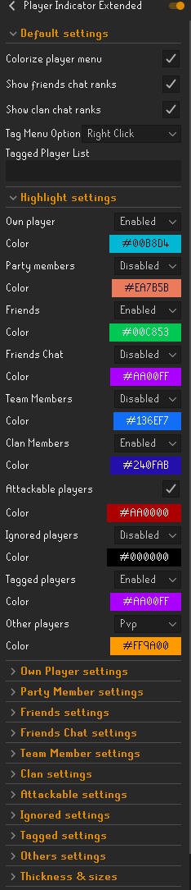
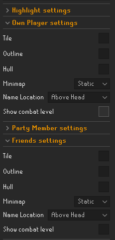
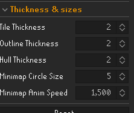

# Runelite Player Indicator Extender plugin

## Intro

This plugin is a replacement and extension of the built in "Player Indicator" plugin in runelite. It has all
the same features as the original, but more categories and they're more customizable.

## Main settings

Below in the image you can see all the categories you can turn on and off. And some of the added settings at the top.

Some categories are added compared to the original:

- `Attackable` - Players you can currently attack, or be attacked by.
- `Ignored` - Players on your ignore list
- `Tagged` - You can now tag players by username, or via the right click option (you can disable this)

## Settings per category

Each category can be further customized, you can customize the following settings:

- `Tile`
- `Outline`
- `hull` - clickable area of the player
- `minimap` - can be turned off, default is static which is just a regular dot. You can also set various animations
- `Name location` - Same as the original plugin
- `Show combat level` - Shows combat level next to their name (like when right-clicking)

## Line thickness settings

You can change the look of the lines drawn. Or the dots on the minimap.

